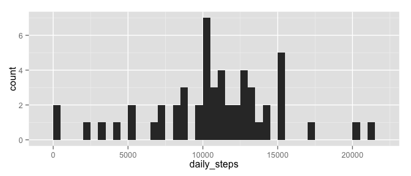
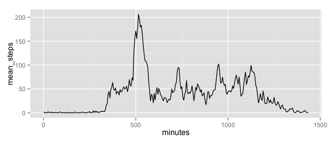
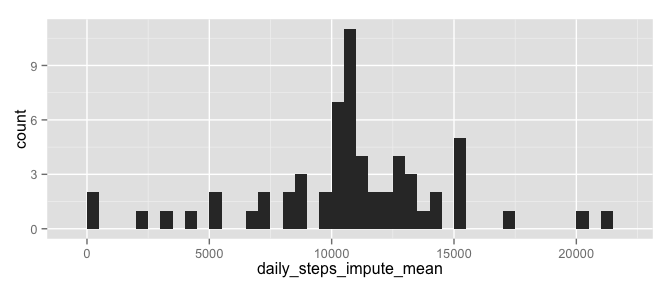
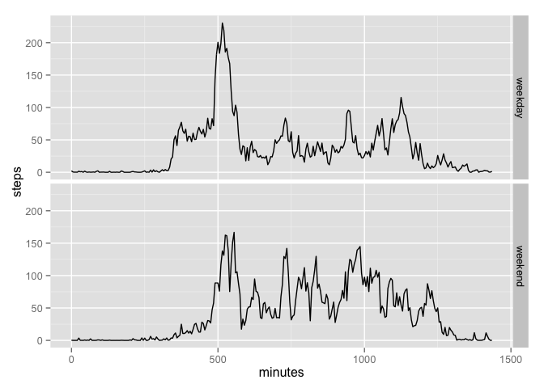
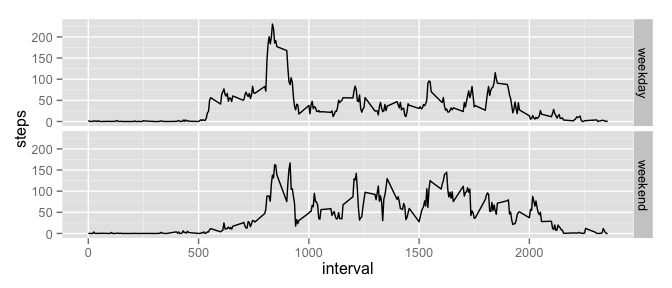

# Reproducible Research: Peer Assessment 1


## Loading and preprocessing the data

First, I load the activity data, which has 3 columns:
steps, date, and interval.
(*Note: unzip activity.zip if activity.csv is not already
in the working directory.*)

```r
activity <- read.csv("activity.csv", 
                     colClasses = c("integer", "Date", "integer"))
str(activity)
```

```
## 'data.frame':	17568 obs. of  3 variables:
##  $ steps   : int  NA NA NA NA NA NA NA NA NA NA ...
##  $ date    : Date, format: "2012-10-01" "2012-10-01" ...
##  $ interval: int  0 5 10 15 20 25 30 35 40 45 ...
```
Looking at the beginning of the interval column, we can see that if we use it as the dependent variable of time series plots there will be gaps between the end of one hour and the start of the next:

```r
head(activity$interval, n = 15)
```

```
##  [1]   0   5  10  15  20  25  30  35  40  45  50  55 100 105 110
```
Notice how the interval number skips from 55 to 100, instead of 60. To eliminate these gaps, I create a new column that is simply the total number of elapsed minutes in each day:

```r
activity$minutes = trunc(activity$interval/100) * 60 + 
    (activity$interval %% 100)
head(activity$minutes, n = 15)
```

```
##  [1]  0  5 10 15 20 25 30 35 40 45 50 55 60 65 70
```

## What is mean total number of steps taken per day?

To find the mean number of steps per day, we first need to add up the total number of steps for all 5-minute intervals in each day. We can do that using tapply:

```r
daily_steps <- tapply(activity$steps, activity$date, sum) 
```
Since we are instructed to ignore NA values for this part, I do not include the argument na.rm = TRUE (which would, for example, count any day with only missing values as having zero steps). This means that the daily_steps vector will have NAs for some days.

Now we can plot the histogram of the number of steps taken each day. I'll use the ggplot2 package for plotting, so we need to load it first.

```r
library(ggplot2)
qplot(daily_steps, binwidth = 500)
```

 

We can find the mean and median number of steps, ignoring NAs, as follows:

```r
mean(daily_steps, na.rm = TRUE)
```

```
## [1] 10766.19
```

```r
median(daily_steps, na.rm = TRUE)
```

```
## [1] 10765
```

## What is the average daily activity pattern?

The following tapply function finds the mean number of steps in each 5-minute interval (averaged over all days in the data set):

```r
mean_steps <- tapply(activity$steps, activity$minutes,
                     mean, na.rm = TRUE)

daily_pattern <- data.frame(minutes = as.integer(names(mean_steps)),
                            mean_steps = mean_steps)
qplot(minutes, mean_steps, data = daily_pattern, geom = "line")
```

 


```r
max_steps_index <- which.max(daily_pattern$mean_steps)
max_steps_minutes <- daily_pattern$minutes[max_steps_index]
max_steps_minutes
```

```
## [1] 515
```
The maximum number of steps occurs 515 minutes into the day. Now convert this back to the 5-minute interval identifier:

```r
max_steps_interval <- activity$interval[which.max(
    activity$minutes == max_steps_minutes)]
max_steps_interval
```

```
## [1] 835
```
So the maximum of the average number of steps occurs in interval 835, i.e., 8:35 to 8:40 in the morning.

## Imputing missing values

The complete.cases function gives the number of rows without any NAs, so to find the total number of rows that have missing values we can negate this function and add up the result:

```r
n_missing <- sum(!complete.cases(activity))
n_missing
```

```
## [1] 2304
```
So 2304 of the 17568 rows have missing data.

The time series plot from the previous section shows that the mean number of steps in each 5-minute interval provides information about the typical patterns of activity throughout the day, so we can use these mean values to fill in any missing values in the data set. There are dedicated functions in certain R packages that I could use to do this, but since I've already computed the mean steps per 5-minute interval it's easy enough to just use mapply with a function that checks for NA values and fills them in with the mean for the corresponding interval:

```r
steps_impute_mean <- mapply(function(steps, minutes) {
    ix <- as.character(minutes)
    if(is.na(steps)) steps <- daily_pattern$mean_steps[ix]
    steps
}, activity$steps, activity$minutes)

activity_impute_mean <- activity
activity_impute_mean$steps <- steps_impute_mean
```
Now we have a copy of the activity data frame where the missing step values are replaced by the per-interval mean.

The histogram for the total number of steps per day in the new data set now looks like this:

```r
daily_steps_impute_mean <- tapply(activity_impute_mean$steps, 
                                  activity_impute_mean$date, sum)
qplot(daily_steps_impute_mean, binwidth = 500)
```

 

This histogram is basically the same as what we found before except that there are now more days in the second bin above 10000 steps. 
This seems to make sense given our strategy for imputing missing data, since the total number of steps in the average daily activity pattern is

```r
total_mean_steps <- sum(daily_pattern$mean_steps)
total_mean_steps
```

```
## [1] 10766.19
```
Therefore, any day where all the data were missing was replaced by a day with about 10766 steps, increasing the count in the bin for the range 10500 to 11000 steps.

Finding the mean and median of the new data set as before gives:

```r
mean(daily_steps_impute_mean)
```

```
## [1] 10766.19
```

```r
median(daily_steps_impute_mean)
```

```
## [1] 10766.19
```
The mean value is the same as before, and the median has increased slightly so it is now equal to the mean. Since I used the mean to fill in missing values it's not surprising that the mean number of steps didn't change, and since the median of the data with missing values was already very close to the mean, the addition of several days with the same number of steps (equal to the mean) simply shifted the median to that value.

## Are there differences in activity patterns between weekdays and weekends?

Using the weekdays function, we can create a factor classifying each date as a weekend day (Saturday and Sunday) or weekday day (all other days):

```r
day_type <- sapply(activity_impute_mean$date, function(date) {
    day <- weekdays(date)
    if(day == "Saturday" | day == "Sunday") {
        day_type <- "weekend"
    } else {
        day_type <- "weekday"
    }
    day_type
})
activity_impute_mean$day_type <- factor(day_type)
```
To plot the time series of activity for weekdays and weekends, I will use the ggplot function this time instead of qplot, and use stat_summary to calculate the mean number of steps in each 5-minute interval:

```r
ggplot(activity_impute_mean, aes(minutes, steps)) +
    stat_summary(fun.y = mean, geom = "line") +
    facet_grid(day_type ~ .)
```

 

We can see that there are some clear differences between weekday and weekend activity. On average, on weekdays there are more steps in the morning (before about 10:00), whereas on weekends there are more steps in the middle of the day and at night.

Note that since the x-axis variable is the minutes column, which removes the gaps between hours in the interval column, the range of x-axis values differs from the reference plot in README.md. If we want something that looks more like that example, we can make the same plot with the interval column as the dependent variable:

```r
ggplot(activity_impute_mean, aes(interval, steps)) +
    stat_summary(fun.y = mean, geom = "line") +
    facet_grid(day_type ~ .)
```

 
